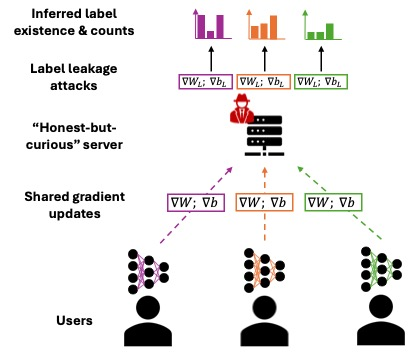

# Label Leakage in Federated Inertial-based Human Activity Recognition

## Abstract
While prior work has shown that Federated Learning (FL) updates can leak sensitive information, label reconstruction attacks, which aim to recover input labels from shared gradients, have not yet been examined in the context of Human Activity Recognition (HAR). Given the sensitive nature of activity labels, this study evaluates the effectiveness of state-of-the-art gradient-based label leakage attacks on HAR benchmark datasets. Our findings show that the number of activity classes, sampling strategy, and class imbalance are critical factors influencing the extent of label leakage, with reconstruction accuracies reaching up to 90\% on two benchmark datasets, even for trained models. Moreover, we find that Local Differential Privacy (LDP) techniques such as gradient noise and clipping offer only limited protection, as certain attacks still reliably infer both majority and minority class labels. We conclude by offering practical recommendations for the privacy-aware deployment of FL-HAR systems and identify open challenges for future research.

## Data download
In order to rerun experiments, data as well as pretrained models need to be downloaded from [here](https://uni-siegen.sciebo.de/s/1vSBUw0VGPuQCpm) and placed in the main directory of the repository. 

## Raw experimental results
In an effort to encourage future research, we outsource experimental results. The GitHub provides additional confusion matrices as well as a spreadsheet containing an overview of results all experiments (see `experimental_results` folder). Raw experimental results can be downloaded [here](https://uni-siegen.sciebo.de/s/odnmXR6LSyLDhyG).

## Installation
Please follow instructions mentioned in the [INSTALL.md](/INSTALL.md) file.

## Reproduce Experiments
Once having installed requirements, one can rerun experiments by running either the `single_step_leakage.py` or `multi_step_leakage.py` script. The folder `job_scripts` contains collections of commands of all experiments. 

## Logging using Neptune.ai
In order to log experiments to [Neptune.ai](https://neptune.ai) please provide `project` and `api_token` information in your local deployment (see `single_step_leakage.py` and `multi_step_leakage.py`). Using the `neptune_evaluation.py` script runs logged to neptune can be re-evaluated at will.

## Contact
Marius Bock (marius.bock(at)uni-siegen.de)
